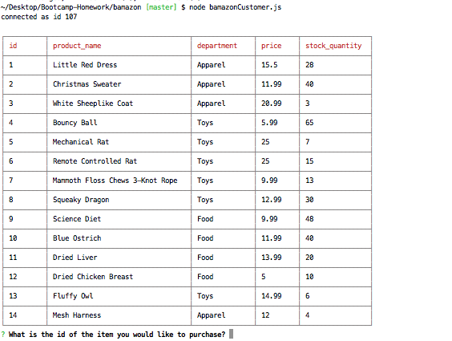
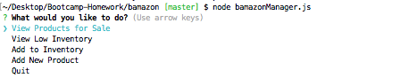
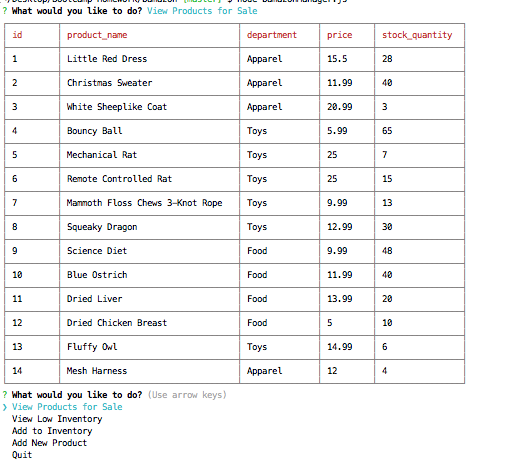
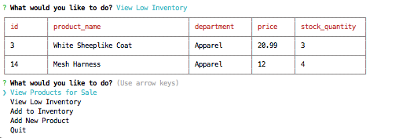
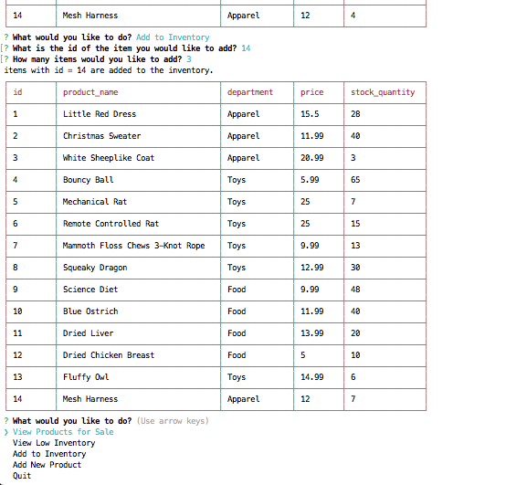
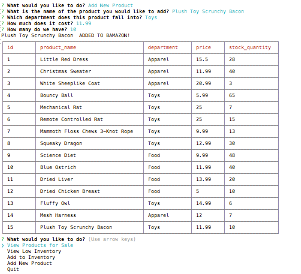

# bamazon
### by Halina Z

#### Description

_________________________________________________________________

The program is CLI Amazon-like dog storefront with the MySQL database as a data storage consisting of two parts. First part of the program allows to take in orders from customers and deplete stock from the store's inventory. Second part allows to view products, view low inventory products, increse quantity of any item currently in store, and allows the manager to add a completely new product to the store.
_________________________________________________________________

##### Customer view: 

The program displays the products table with the following columns: 

_________________________________________________________________

##### Manager view: 

The program prompts a user (manager) to select one of the following options: 

If **View Products for Sale** option is selected, the products table is retrieved and displayed:

If **View Low Inventory** option is selected, the products which quantity is less than 5 are displayed:

If **Add to Inventory** option is selected, the app prompts to enter the id of the item to add to inventory, and the number of items to add, then displayes the message with the number of the item added, and retrives and displays the updated content of the products table:

If **Add New Product** option is selected, the app prompts to enter the name of the new product, then displayes the list of the departments and ask to select the department, then asks to enter the price and the number of the items to order. After that the app displays the message that the item was added to the store, updates the database table and displayes the updated table content:

If the user picks **Quit**, the program exits:

