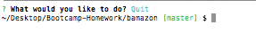

# bamazon
### by Halina Z

#### Description

_________________________________________________________________

The program is two-parts CLI Amazon-like storefront selling products for dogs, with the MySQL database as a data storage. First part of the program allows to take in orders from customers and deplete stock from the store's inventory. Second part allows to view all products, view low inventory products, increse quantity of any item currently in store, and allows the manager to add a completely new product to the store.
_________________________________________________________________

#### Customer view: 

The program displays the products table with the following columns: 

The app promps the user to enter the id of the product to buy and the desired quantity, and if there are sufficient quantity of the items in the inventory, the program updates the database and displays the message with the item purchased and the total cost of the purchase.

If the user eneters the quantity higher than the number of the items in the inventory, the program displays the corresponding message and prompts to reorder:

To quit the program, the user should enter **Q** when prompted:

_________________________________________________________________

#### Manager view: 

The program prompts a user (manager) to select one of the following options: 

If **View Products for Sale** option is selected, the products table is retrieved and displayed:

If **View Low Inventory** option is selected, the products which quantity is less than 5 are displayed:

If **Add to Inventory** option is selected, the app prompts to enter the id of the item to add to inventory, and the number of items to add, then displays the message with the quantity of the selected item added to the inventory, and retrives and displays the updated content of the products table:

If **Add New Product** option is selected, the app prompts to enter the name of the new product, then displays the list of the departments and ask to select the department, then asks to enter the price and the number of the items to order. After that the app displays the message that the item was added to the store,updates the database table and displays the updated table content:

If the user picks **Quit**, the program exits:

_________________________________________________________________

Technologies used: 
  * node.js
  * mySql db
  * Packages: 
    * mysql
    * inquirer
    * cli-table2
_________________________________________________________________

